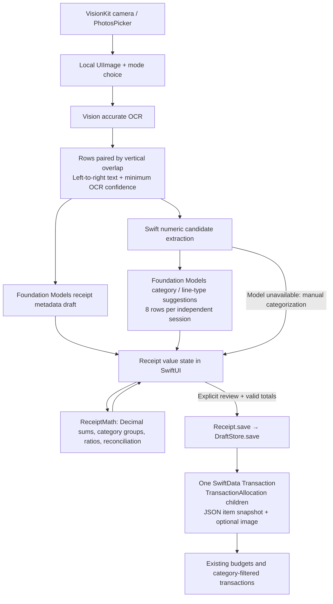
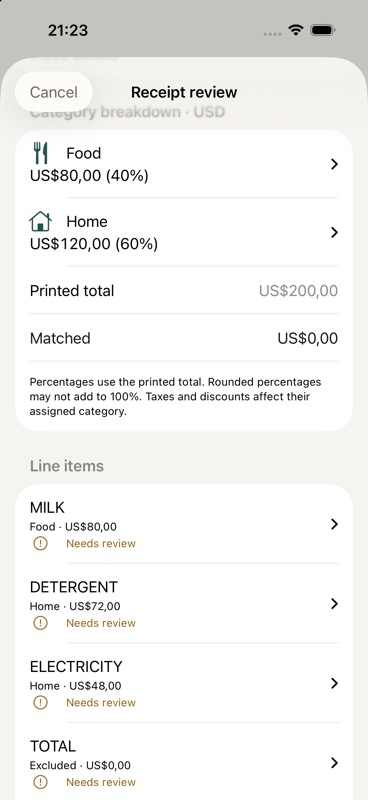

# Receipt categorization: design and implementation

## User experience

1. Open Receipt, then scan with the document camera or import with PhotosPicker. The image stays in memory on the device. Camera capture currently uses the first scanned page.
2. Choose **Single category** or **Split by category** in the post-capture dialog. Cancel leaves the image available for a later “Read receipt” action. The mode picker also supports manual entry and switching without losing item edits.
3. Check the image, merchant, purchase date, scope, currency and printed final total. Missing or unavailable model output stays editable.
4. Single mode uses the existing category picker and saves the entire total to that category.
5. Split mode shows category groups with amounts, percentages and expandable item lists. Each line has an editor for description, printed line total, category, item/tax/discount type, quantity and unit-price references, and an exclusion switch. Excluded summaries and included VAT remain visible for verification. Discounts subtract their positive entered amount.
6. Correct uncertain categories, check every line, and verify the receipt details. The difference must be exactly zero; missing categories, invalid currency precision, negative category balances and unreviewed lines block saving. A category override immediately recalculates groups and percentages. Editing a line resets its reviewed state.
7. Confirm once to save one expense with category allocations. A possible-duplicate dialog compares merchant, day, scope, currency and total. Image retention is an explicit opt-in. Switching to single mode saves no hidden item allocations.

Native Form, DisclosureGroup, Picker, sheets and accessible text labels use the existing palette and amount/category controls. Layouts stack the name and amount to accommodate larger text. Review status has text and symbols as well as color. Category confidence and OCR confidence have distinct labels.

## Architecture



`ReceiptScanView` owns a `Receipt` through `@State`. Bindings edit its `TransactionDraft` and `ReceiptItem` values. Derived `breakdown`, `remaining` and `canSave` properties avoid a second cached source of totals. Processing disables editing; cancellation is checked after asynchronous OCR/model work and before results are applied. A new image resets the draft. Scope changes invalidate incompatible categories; currency changes require line review again, without converting any amounts.

No new persistence model or schema migration is needed. Existing allocation-aware budget and search code remains the accounting source of truth. The existing transaction editor shows saved allocations and permits merchant/date/note edits; it locks total/type/category on saved splits so later editing cannot silently invalidate allocation sums. Changing a saved split currently requires replacing that expense.

## Data models and implementation map

| Type / file | Responsibility |
|---|---|
| `Receipt` — `Moneva/AI/Core/ReceiptDraft.swift` | Editable receipt metadata, selected mode, items, computed groups, exact save gate and save adapter. |
| `ReceiptItem` — same file | UUID identity; description; positive Decimal line amount; item/tax/discount type; category reference; optional quantity/unit-price text; exclusion; source OCR; OCR confidence; category certainty; verification state. |
| `CategoryBreakdown` — same file | Existing `ReceiptAllocation`, contributing items, and optional Decimal fraction of the printed total. |
| `ReceiptAllocation` / `ReceiptMath` — same file | Existing category grouping and reconciliation. Amounts are authoritative; percentages are presentation. |
| `DraftedReceipt`, `ReceiptLineSuggestion`, `ReceiptLineSuggestions` — same file | Guided model outputs. Split suggestions carry allowlisted category indices and source row indices; they cannot supply or rewrite prices. |
| `ReceiptTextRow`, `ReceiptText` — `Moneva/AI/Core/ReceiptScan.swift` | OCR row reconstruction, source confidence, conservative printed-price normalization and fallback candidates. |
| `ReceiptScanView`, `ReceiptItemRow`, `ReceiptBreakdownSection` — `Moneva/AI/Views/ReceiptScanView.swift` | Input, mode dialog, review state, line-edit sheets and live grouped summary. |
| `SavedReceiptItem` / `TransactionAllocation` | Local JSON audit snapshot and existing SwiftData category relationships. Saved item category names are historical labels, not relationship identifiers. |
| `DraftStore` — `Moneva/AI/Core/VoiceDraft.swift` | Existing validation, transactional save, rollback and stable draft-ID deduplication. |

For the requested example, Swift derives the following from reviewed lines, with total `Decimal(200)` and currency `USD`:

```text
Food:       80 USD (40%)
Household:  72 USD (36%)
Utilities:  48 USD (24%)
```

UI amounts use the device's locale and currency formatter. Ratios are `categoryAmount / printedTotal`, formatted with up to one fractional percentage digit. A missing/zero total shows an em dash instead of dividing by zero. Rounded percentages can sum to 99.9% or 100.1%; there is no adjustment to the money to force a prettier display. Zero-net categories may remain visible during review and are omitted from persisted allocations.

## Extraction and model optimization

### Implemented OCR safeguards

- Vision accurate recognition with language correction and automatic language detection. Camera capture supplies document edge detection and perspective correction; imported image orientation is normalized before recognition.
- Group boxes by actual vertical-center proximity using the smaller box height; order columns left to right. This fixes the previous fixed-band boundary where a price a few pixels below its label could land on a different row.
- Preserve the original combined row and the minimum constituent OCR confidence. Confidence describes character recognition, not price pairing or category correctness.
- Select a conservative rightmost numeric candidate as the printed line total. Support decimal comma/dot, common currency symbols, negative/trailing-minus discounts, and explicit grouped formats such as `1,234.56` and `1.234,56`. Reject malformed grouped numbers; retain raw OCR for manual correction.
- Never multiply quantity by unit price or allow the language model to calculate a total. Quantity and unit price are optional reference fields; repeated items remain separate rather than being deduplicated by name.
- Known English summary/payment labels are excluded conservatively. Other languages, tax-included conventions and uncommon layouts require model suggestions and explicit review. Every excluded row is still reviewable, preventing an invisible heuristic from deciding the final expense.

### Implemented semantic mapping

- Use the existing on-device Foundation Models gateway. Prompts classify each product's purpose, with examples for food, detergent, electricity and opaque SKU descriptions. Merchant-wide category rules are disabled for split saves.
- Categories come from the app's current expense/scope allowlist and receive numeric IDs per request. This disambiguates categories with the same display name. Unknown IDs resolve to no category. Duplicate row IDs are ignored and unrequested row IDs cannot create items.
- Treat category names and OCR text as untrusted prompt data, never instructions. Guided generation constrains the output shape; Swift still validates IDs and all money.
- Eight rows per fresh model session bound per-call output and prevent conversation history growth. The existing gateway also limits input length and handles device/language availability. Oversized category lists or context errors use manual fallback. No rows are silently dropped to fit a model request.
- Category certainty is `likely` or `uncertain`, with a short reason. This is a model suggestion, explicitly **not a calibrated probability**. OCR has its own numeric score. Neither can mark a line reviewed.
- Generation failure retains all initial OCR candidates and leaves categorization manual. There is no external service fallback, new dependency or model download managed by the app.

### Accuracy work to pursue with measured receipt data

The current implementation does not claim a measured classification accuracy. Before adding a Core ML model, build a consented, local evaluation set containing abbreviated descriptions, mixed merchants, multiple languages, quantities, discounts, included/exclusive VAT, skewed photos and difficult separators. Keep merchants/layouts separated between training and evaluation to measure generalization. Track line-price pairing precision/recall, exact amount accuracy, category macro-F1, correction rate, reconciliation rate and latency. Re-run it after OS/model updates.

For persistent failure clusters, add fixture-backed layout handling: normalized x-column detection, local skew estimation, and adjacent wrapped-description attachment with an ambiguity flag. Avoid globally joining nearby rows; that can attach a price to the wrong item. Consider OCR alternate candidates only if validated amounts and geometry distinguish them; otherwise ask the user. Numeric confidence thresholds should be chosen from evaluation data rather than assumed to be probabilities of a correct receipt.

If clear product descriptions remain misclassified, add a small reviewed product-alias lexicon or a trained Natural Language/Core ML text classifier with an abstention threshold. Train on product-purpose labels, then map those labels to current user categories. Keep unfamiliar products and conflicting custom categories unresolved. Evaluate calibrated confidence and out-of-distribution behavior on held-out receipts before allowing fewer review steps. Generic embedding similarity alone is insufficient evidence for an automatic financial category. Core ML training/adapters are recommendations, not shipped assets.

For tax and receipt-wide discounts, the implementation requires explicit category assignment or explicit per-category adjustment lines. It deliberately does not guess a proportional allocation or add an unexplained balancing line. User review resolves the mismatch against the printed receipt.

Apple references: [Vision RecognizeTextRequest](https://developer.apple.com/documentation/vision/recognizetextrequest), [OCR confidence](https://developer.apple.com/documentation/vision/recognizedtext/confidence), [Foundation Models generation and availability](https://developer.apple.com/documentation/foundationmodels/generating-content-and-performing-tasks-with-foundation-models), [Natural Language text classification](https://developer.apple.com/documentation/naturallanguage/classifying-natural-language-text).

## Verification

The existing DEBUG startup self-checks include regression cases for row pairing across the previous band boundary, OCR confidence propagation, comma/dot/grouped money, discounts and excluded totals, invalid/duplicate model IDs, unchanged model-boundary amounts, 40/36/24 percentages, live regrouping, zero totals, explicit line review, scope rejection, currency precision, exact reconciliation, zero-net categories, persistent allocation/item round-tripping and repeat-save deduplication. These extend the existing included-tax, exclusive-tax, budget and search checks.

Build and launch the DEBUG app on iOS 26.5 to execute them:

```sh
xcodebuild -project Moneva.xcodeproj -scheme Moneva \
  -destination 'generic/platform=iOS Simulator' -configuration Debug build
```

Physical-device acceptance must cover real camera capture, Apple Intelligence generation on an eligible device, long multilingual receipts, poor lighting, rotation and VoiceOver/Dynamic Type. Simulator and synthetic checks validate code paths and accounting invariants; they do not establish real-receipt model accuracy.

### Validation run (7 September 2026)

- iOS 26.5 / iPhone 17 Pro Debug build succeeded; launch printed `Moneva AI feature self-checks passed` over the existing simulator store.
- A synthetic receipt was imported through the real PhotosPicker and Vision OCR. The mode dialog appeared; the printed total was 200 USD, with milk 80, detergent 72, electricity 48, and excluded total/card-payment rows. The UI displayed 40%, 36%, 24% and zero difference.
- The available simulator model classified milk as Food and detergent as Home, but incorrectly suggested Transport for electricity when Utilities was absent. Stronger abstention wording did not reliably resolve this example. This is a measured limitation of prompting alone; all category suggestions still require line verification, regardless of the model's “likely” label.
- Runtime review caught a sheet-presentation issue when category sheets were attached to virtualized item rows. Moving presentation to `ReceiptScanView` fixed it. The category picker now opens and dismisses while preserving the receipt; overriding electricity to Home immediately changed the summary to Food 80 USD (40%) and Home 120 USD (60%), still matching 200 USD.
- The synthetic review was not saved to the simulator's existing ledger. Persistence, idempotency and allocation round-trips were exercised in the in-memory DEBUG checks.


